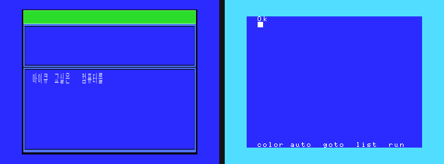

# Daewoo CPC-300 / CPC-300E — 튜터(IQ-CLASS) 진입 차단



왼쪽이 스톡(부팅하면 `아이큐 교실…`), 오른쪽이 no_tutor 팩(BASIC `Ok`).
둘 다 openMSX Daewoo_CPC-300, t=20s.

## 한글 ROM 하나에 둘이 들어있다

`cpc-300_hangul.rom` (32 KB, sha1 `47a9d9a2…`) 에는 **카트리지 헤더가 두 개** 있다.

| 파일 오프셋 | 매핑 | 헤더 | 내용 |
|---|---|---|---|
| `0x0000` | `0x4000` | `AB` INIT=`0x4244` STATEMENT=`0x4383` | **한글 드라이버** |
| `0x4000` | `0x8000` | `AB` INIT=`0xBF00` | **IQ-CLASS 튜터** |

- 페이지 1 = 드라이버. INIT이 한글 후크 6종(H.CHPH `0xFDA4`, H.CHGE `0xFDC2`,
  H.QINL `0xFDDB`, H.INLIN `0xFDE0`, H.ONGO `0xFDE5`, `0xFFB6`)을 걸고,
  STATEMENT가 `CALL HANON` / `HANOFF` / `ADJUST` 를 받는다.
- 페이지 2 = 튜터. `0x8011` 부터가 **토큰화된 BASIC 프로그램**이고
  (`PAGE0,` `"grp:"` `HAN0,` 같은 조각이 그대로 보인다), `0xBF00` 이 그 런처다.

**즉 한글 ROM을 빼면 한글도 같이 죽는다.** 튜터만 떼려면 ROM 안에서 막아야 한다.

## 튜터 런처 `0xBF00`

```
BF00  C3 0C BF     JP 0BF0CH
BF0C  LD A,(0FD0CH) / BIT 0,A / RET NZ
BF12  LD HL,0BF81H  ; "IQ-CLASS:"
      LD DE,0F378H / LD B,08H / CALL 0BF2BH   ; 8바이트 비교
BF1D  JR NZ,0BF33H                            ; 불일치 -> 튜터
BF1F  0F378H..+8 을 0xFF 로 지우고 RET        ; 일치   -> BASIC
BF33  H.KEYA(0FDCCH) <- F7,<slot>,0BF66H      ; 탈출키 후크
      ENASLT / TXTTAB(0F676H) <- 8011H / JP 7E14H   ; 튜터 실행
BF66  탈출 후크: 0F378H 에 시그니처를 쓰고 JP 0000H (리셋)
```

콜드 부팅에는 `0xF378` 이 쓰레기라 **항상 튜터로 간다**. 튜터에서 탈출키를 누르면
시그니처를 심고 리셋 → 다음 부팅에서 `BF1F` 로 빠져 BASIC. 즉 **머신 스스로
"BASIC으로 부팅"하는 경로를 이미 갖고 있다.**

## 패치 — 1바이트

파일 `0x7F00` (= 매핑 `0xBF00`) : `C3` → `C9`. INIT이 즉시 RET 한다.

- 그 자체가 위 탈출 경로와 같은 결과다. 새 코드가 아니라 **실기에서 이미 도는 경로**.
- `0xBF0C` 를 참조하는 곳은 `0x7F01`(헤더 벡터) 하나뿐 — 바이너리 전수 검색으로 확인.
  튜터 페이로드도, 페이지 1 드라이버도 손대지 않는다.
- 결과 sha1 `0c3dace2e3748486973b1d037147601fd49ce78a`.

재생성: `tools/CreateMSXpack/patch_cpc300_notutor.py`
(ROM은 gitignore라 리포에 못 넣는다. 스크립트가 입력 sha1과 두 헤더 위치를 검증한다.)

## 검증 (openMSX, 전용 `OPENMSX_HOME`)

| | 스톡 | 스톡 + 자체 탈출 | no_tutor 패치 |
|---|---|---|---|
| TXTTAB | `8011` (ROM) | `8001` | `8001` |
| SCRMOD | 7 | 1 | 1 |
| H.KEYA | `F7 84 66 BF` | `C9 C9 C9 C9` | `C9 C9 C9 C9` |
| 한글 후크 6종 | 설치됨 | 설치됨 | **설치됨** |
| 화면 | 아이큐 교실 | BASIC `Ok` | BASIC `Ok` |
| `CALL HANON` | — | Syntax error | Syntax error(동일) |

`CALL HANON` 이 syntax error인 건 **스톡도 똑같다** — 패치와 무관한 기존 거동이다
(A/B로 확인). 관측한 모든 항목에서 `패치본 == 스톡의 자체 탈출 경로`.

## 팩

`tools/CreateMSXpack/Computer/Daewoo/Daewoo_CPC-300{,E}_no_tutor.xml`

CPC-300E는 한글 ROM sha1이 CPC-300과 **같아서** 패치본 하나를 공유한다.
E 쪽 차이는 sub ROM(`cpc-300e_msx2sub.rom`, `09f7d788…`)과 RAM 64 KB 뿐.

빌드 결과가 의도대로인지 팩 바이너리로 직접 확인했다:

- `Daewoo_CPC-300.MSX` ↔ `Daewoo_CPC-300_no_tutor.MSX` : **정확히 1바이트** (`C3`→`C9`)
- `..._no_tutor` ↔ `..E_no_tutor` : 63바이트 = sub ROM 62 + RAM block_count `8`→`4` 1

> ⚠️ `<block>` 은 `<SHA1>`, `<device><rom>` 은 `<sha1>` 이다. 대소문자를 틀리면
> 조용히 무시되고 팩이 작게 나온다(예전에 한자 폰트 256 KB를 이렇게 날렸다).
